# 이모티콘을 만들어보자..

## 포토샵 기본

이모티콘을 상용화 시키려면 당연한 말이지만 포토샵을 어느정도는 쓸 줄 알아야합니다. 재미있는 그림과 아이디어가 있는데도 포토샵을 못 써서 이모티콘을 못 만들면 슬프겠죠.. 그래서 이모티콘을 만들기 위해 필요한 아주 기본적인 포토샵 기능을 알려드리겠습니당. 이모티콘을 제작하는 데에는 아주 아주 기본적인 편집 기능만 알고 있으면 됩니다. 너무 겁먹지 마세요!

※ 이 자료의 경우 포토샵 CC 2020 한글판 버전을 기준으로 제작하였습니다!! ※

****

#### 기본 캔버스 설정

포토샵을 켜고 나서 문서를 만들어야 작업을 시작할 수 있겠죠. 자신이 그리는 그림이나 작업에 따라 적절한 크기와 해상도, 색상 모드를 선택하여 캔버스를 만들어주면 됩니다.

참고로 포토샵 CC에서는 기본 템플렛 기능을 제공해주기 때문에 따로 크기를 설정해야하는 귀찮음이 덜합니다.

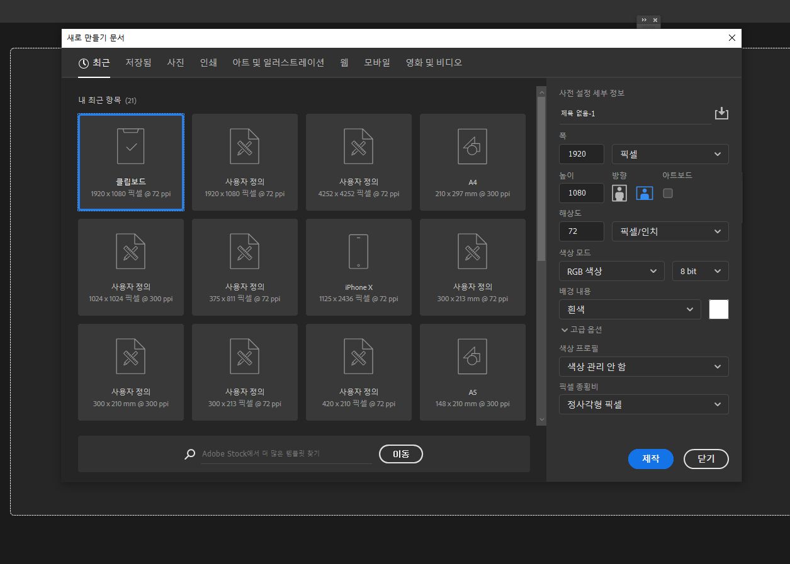

* 사이즈 단위는 픽셀,인치,센티미터,밀리미터, 포인트, 파이카가 있습니다. 보통은 픽셀로 설정해서 작업을 진행합니다. 우리가 만들 카카오톡 이모티콘의 경우 360 × 360 px로 설정해주세욥.
* 해상도의 경우 최소한 72ppi 이상으로 설정하기 바랍니다. (인쇄용일 경우 300ppi)

* 색상 모드: RGB(웹), CMYK(인쇄)

  > RGB 모드는 빛의 삼원색(Red, Green, Blue) 혼합으로 색을 구현합니다. 모니터와 액정과 같이 빛을 이용하여 색을 표현하는 경우에 사용됩니다. RGB 모드는 CMYK 모드에 비해 좀 더 다양한 색 표현이 가능합니다. 이러한 이유로 웹에 사용할 이미지는 RGB 모드로 작업하는 것이 좋습니다.

  > CMYK는 물감(Cyan, Magenta, Yellow, Black)의 혼합으로 색을 구현합니다. 실제 인쇄가 되었을 때 즉, 잉크 혼합의 논리로 색이 만들어지죠.  RGB 모드에 비해 CMYK 모드는 풍부한 색 표현이 어렵습니다. 그러나 인쇄물을 제작할 경우 반드시 CMYK 모드로 작업해야합니다. RGB 모드로 작업한 색이 우리가 실제 받아보는 인쇄물에서 똑같이 표현되지 않기 때문이죠.

우리는 이모티콘을 만드는거니까 RGB 모드로 작업하면 됩니당.

#### 포토샵의 화면 구성

포토샵을 켜고 나면 이제 작업 영역(Workspace)이 보일겁니다. 작업 영역이란 이미지를 편집하면서 사용하는 각종 도구와 정보를 보여주는 패널들이 있는 환경을 말합니다.

작업 영역은 크게 도구 속성, 도구 툴, 패널 창으로 구성되어있습니다. 

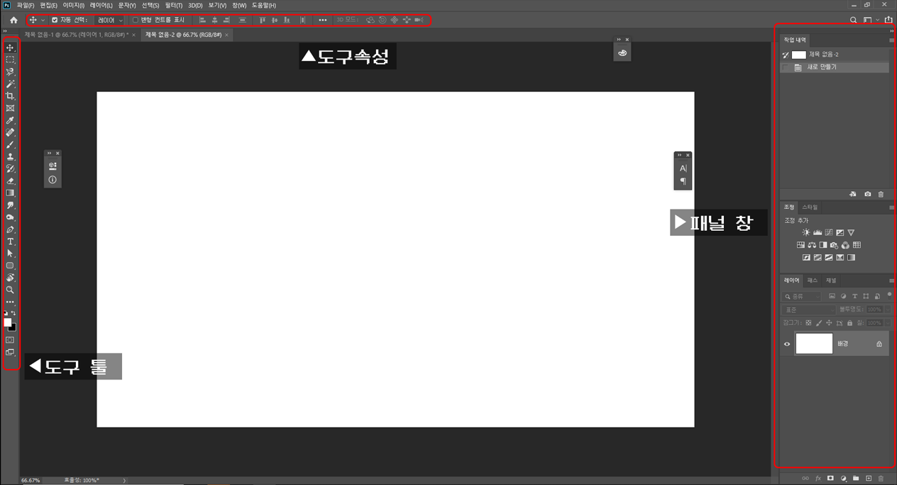

* 도구 툴: 포토샵 작업할 때 쓰이는 기본적인 도구들이 모여있음. 여기에는 메뉴 표시줄에 없는 여러 가지 도구가 나열되어 있습니당.

  ▷ 이 표시가 있는 도구들은 길게 클릭/우클릭시 숨겨진 도구를 선택할 수 있다.

* 도구 속성: 도구 선택를 선택한 뒤, 그 도구의 부가적인 내용을 변경하거나 적용 가능함
* 패널 창: 포토샵을 사용하는 데 있어서 필요한 패널들이 모여있는 창.

### 자주 쓰는 단축키

몇 가지 단축키를 외워놓으면 포토샵 작업할 때 아주 편리합니다. 아주 기본적인 단축키라 다른 프로그램의 단축키와 비슷한 면이 많습니당. 사실 단축키는 아주 많은데 그 중 진짜 많이 쓰는 단축키만 소개할게요. 이건 진짜 기본 중 기본이므로 외우세용. 몇 개 안됩니다.

* ctrl + N: 새로 만들기
* ctrl + O: 열기
* ctrl + S: 저장
* ctrl + shift + S: 다른 이름으로 저장
* ctrl + alt + shift + S: 웹용으로 저장
  - ctrl + S랑 똑같은 거 아니에요? 약간 다릅니다.
    + 웹용으로 저장은 상세 페이지에 올리는 등 이미지 웹용으로 최적화할 필요가 있을때 사용합니당.

* ctrl + W: 닫기

#### 펜툴

___단축키 M___

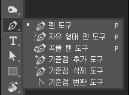

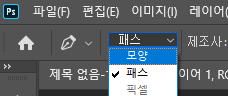
펜툴 도구 속성창을 보면 모양/패스 두 가지가 있죠. 펜툴은 선택 도구로 사용될 수도 있고, 직접 오브젝트를 그릴 수도 있습니당. 전자의 경우 패스를 사용해야하고, 후자의 경우는 모양을 선택하여 사용하면 됩니다.

##### 선택 도구로서의 펜툴

포토샵에서 이미지 합성을 하기 위해서 가장 필요한 부분은 원하는 부분을 잘라내는 것이죠. 원하는 부분만 따오는 작업을 일명 누끼를 딴다고 하는데요. 올가미 툴이나 빠른 선택 (Quick Selection) 툴을 사용할 수 도 있지만 깔끔하게 따기가 몹시 어렵습니다. 그렇기 때문에 정확하고 깔끔한 형태를 위해서는 펜툴을 사용하는 것이 가장 효과적입니다.

패스를 선택하고 먼저 사각형을 그려봅시다. (이모티콘 만드는데에 반드시 반드시 알아야하는 것은 아니지만 사진으로 이모티콘을 만들고 싶을수도 있으니까!!! 배워봅시당!! 몹시 유용한 스킬이니까!)

패스를 만드는 법은 아주 간단합니다. P(펜툴의 단축키) 를 누르고 그냥 클릭, 클릭, 클릭 한 다음에 마지막 처음 클릭 부분을 클릭하여 패스를 닫아주면 됩니다. 짱쉽죵. 그런데 이런 투박한 직선으로 사진을 어떻게 땁니까.. 라는 생각이 들겁니다. 걱정하지 마세요! 패스로 곡선을 만들면 됩니다.

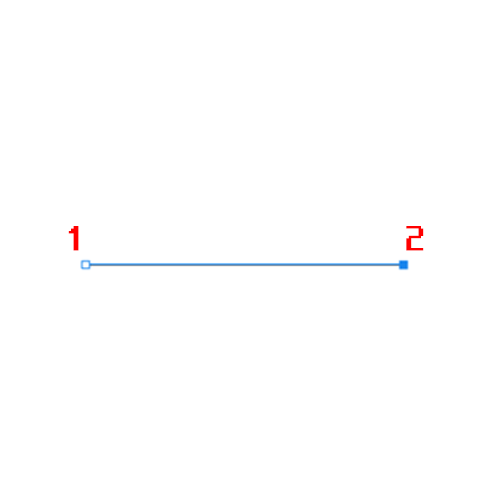
1번 위치를 클릭하고 2번 위치를 클릭하면 패스 한 가닥이 만들어집니다. 이건 딴 이야기지만 45º, 90º로 패스를 움직이고 싶다면 Shift를 누르면서 마우스를 움직이면 됩니다.

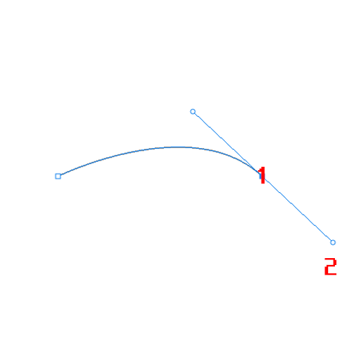

이때 2번, 현재 사진에서는 1번, 에서 손을 떼지 말고 현재 사진에서 2번 방향으로 쭉 잡아당기면 곡선이 만들어집니다. 쉽죠?

이런 식으로 패스를 이용하면 됩니다. 이 방법은 패스로 모양을 만들 때도 똑같이 적용됩니당. 그런데 패스의 경우 모양과 달리 직접적으로 만들어지지 않습니다. 그게 무슨 소리냐? 직접 보면 됩니다.

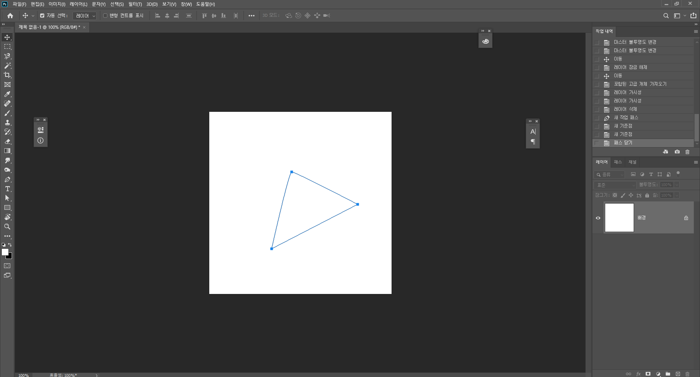

실컷 만들어놔도 딴 곳을 잠깐 누르면..

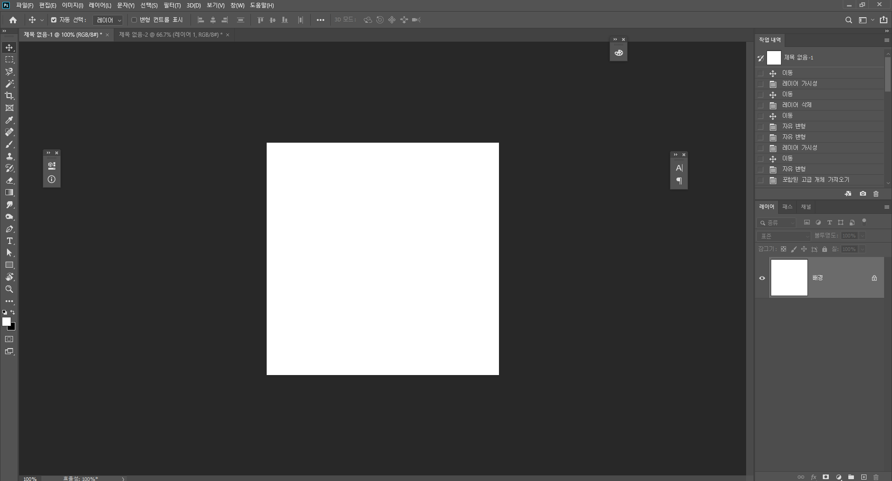

짠 있었는데 없습니다.

그럼 어쩌냐!

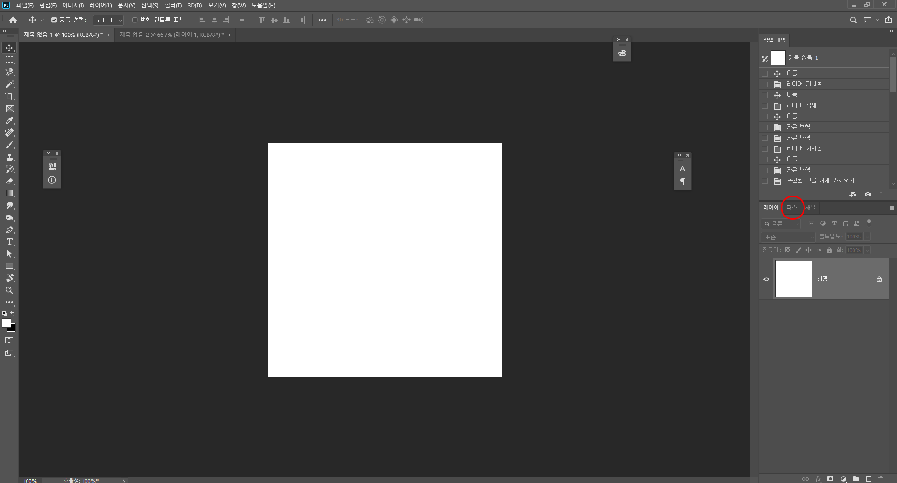

당황하지 말고 레이어 옆에 위치한 패스 패널을 눌러줍니다.

> 혹시 패스 패널이 없다? 그러면 맨 위에 있는 메뉴 표시줄에서 창(W) 을 눌러서 패스 눌러서 패스 패널 켜줍시다.

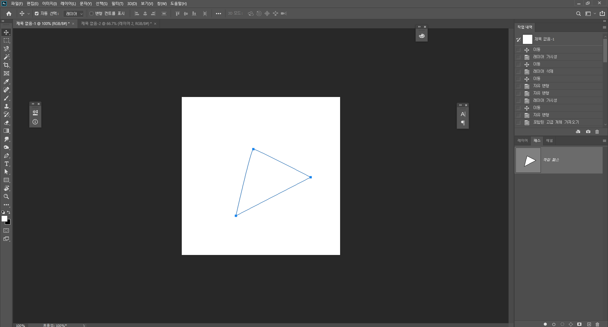

쨔잔~

나옵니다.

> 이것 뿐만 아니라 뭔가 패널 창에서 없어졌다? 필요한 패널이 있다?? 하면 메뉴 표시줄에서 찾으세요~ 포토샵의 작업영역은 본인이 스스로 꾸미는 것입니다...

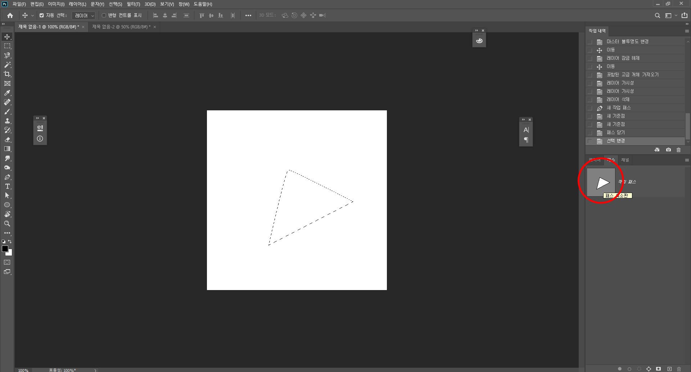

이 다음에 패스 패널의 썸네일(내가 그린 패스 모양이 나타난 곳)을 ctrl을 누른 채로 클릭하면? 짜잔. 내가 그린 패스 만큼의 영역이 선택됩니다.

##### 모양 도구로서의 펜툴

위에 선택 도구로서의 펜툴은 사실 포토샵의 기능 중 사진 합성에 주로 쓰이는 기능입니다. 근데 우리는 이제 이모티콘을 만들어야하니까 모양 도구로서의 펜툴이 더 중요하겠죠?

모양을 만들 때도 위와 같은 과정으로 진행하면 됩니다. 차이점은 모양의 경우 그리는 즉시 바로 볼 수 있다는 것입니당. 

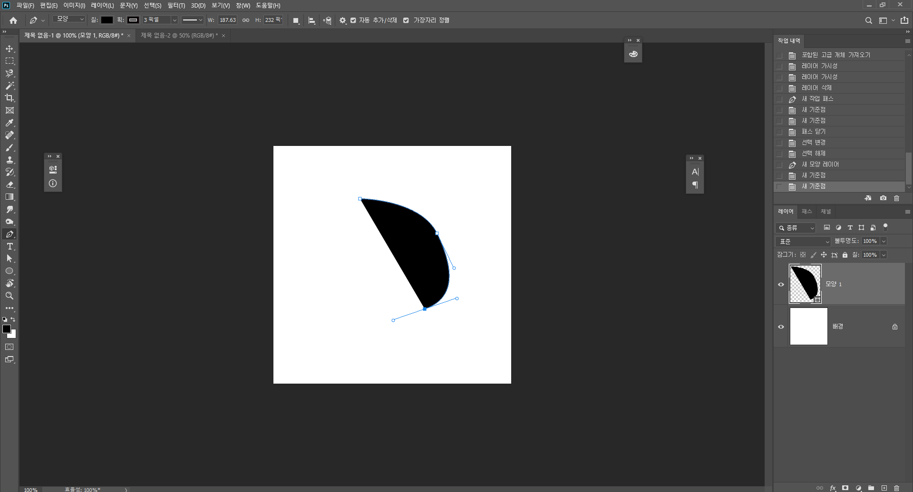

이런 식으로 이제 위와 같은 방법으로 그리면 되는데 만약 나는 선을 쓰고 싶다! 저런 채우는거 하기 싫다! 할 수도 있겠죠. 특히나 우리는 이모티콘을 만들어야하니까 선만 쓰는 법도 알아야합니다.

어떡해 그럼. 자 도구 속성을 살펴보도록 합시다.

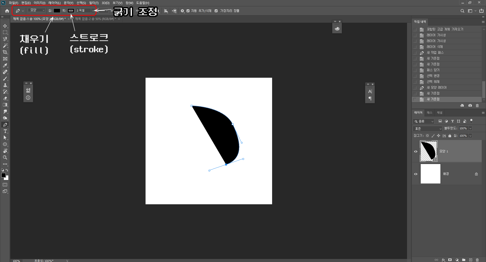

채우기는 말 그대로 도형(모양)의 안을 채우는 역할, 획(스트로크)는 바깥선을 뜻합니다. 

그리고 그 뒤에 바로 브러쉬 도구를 배웁시다. 속성 속성.

