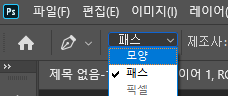
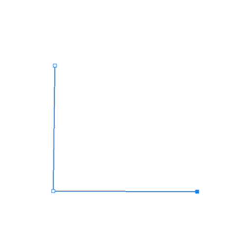
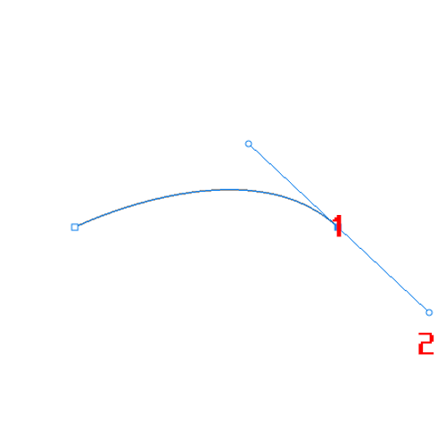
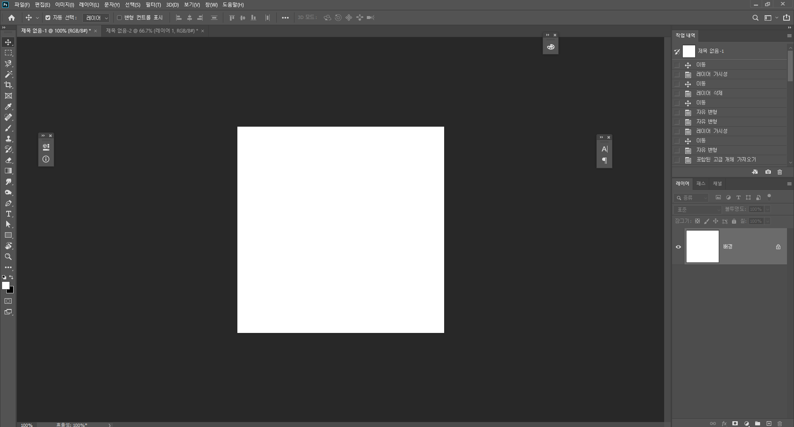
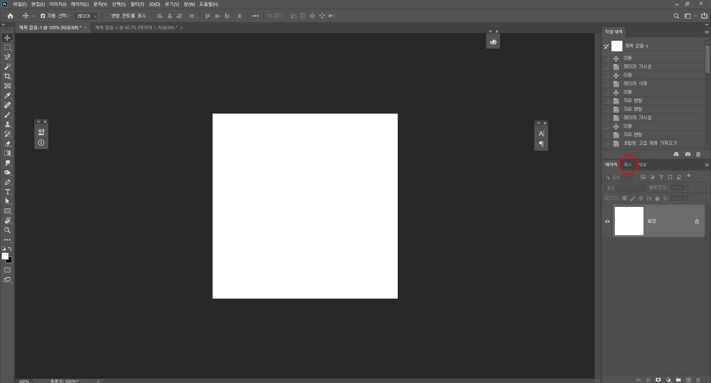
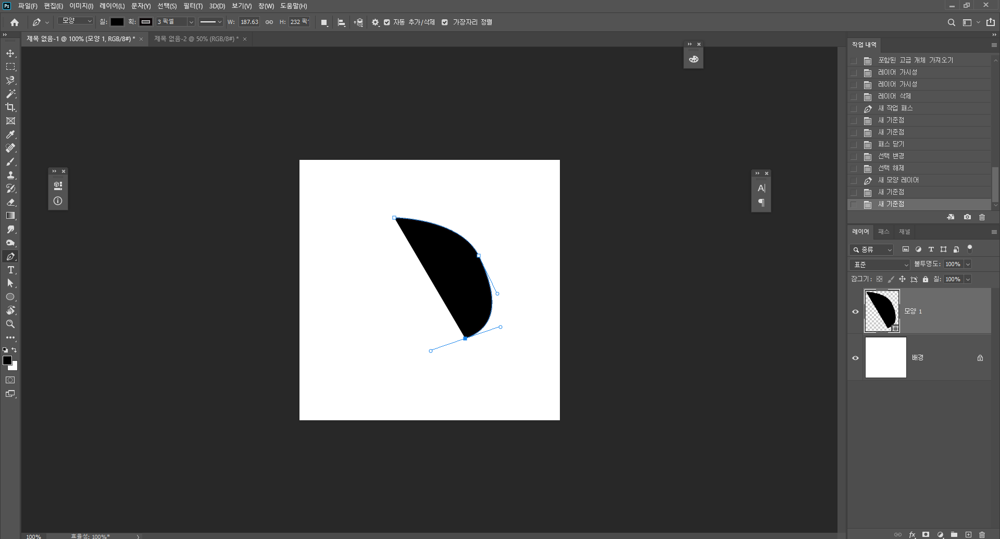

#### 펜툴

___단축키 M___

펜툴 도구 속성창을 보면 모양/패스 두 가지가 있죠. 펜툴은 선택 도구로 사용될 수도 있고, 직접 오브젝트를 그릴 수도 있습니당. 전자의 경우 패스를 사용해야하고, 후자의 경우는 모양을 선택하여 사용하면 됩니다.

##### 선택 도구로서의 펜툴

포토샵에서 이미지 합성을 하기 위해서 가장 필요한 부분은 원하는 부분을 잘라내는 것이죠. 원하는 부분만 따오는 작업을 일명 누끼를 딴다고 하는데요. 올가미 툴이나 빠른 선택 (Quick Selection) 툴을 사용할 수 도 있지만 깔끔하게 따기가 몹시 어렵습니다. 그렇기 때문에 정확하고 깔끔한 형태를 위해서는 펜툴을 사용하는 것이 가장 효과적입니다.

패스를 선택하고 먼저 사각형을 그려봅시다. (이모티콘 만드는데에 반드시 반드시 알아야하는 것은 아니지만 사진으로 이모티콘을 만들고 싶을수도 있으니까!!! 배워봅시당!! 몹시 유용한 스킬이니까!)

패스를 만드는 법은 아주 간단합니다. P(펜툴의 단축키) 를 누르고 그냥 클릭, 클릭, 클릭 한 다음에 마지막 처음 클릭 부분을 클릭하여 패스를 닫아주면 됩니다. 짱쉽죵. 그런데 이런 투박한 직선으로 사진을 어떻게 땁니까.. 라는 생각이 들겁니다. 걱정하지 마세요! 패스로 곡선을 만들면 됩니다.

1번 위치를 클릭하고 2번 위치를 클릭하면 패스 한 가닥이 만들어집니다. 이건 딴 이야기지만 45º, 90º로 패스를 움직이고 싶다면 Shift를 누르면서 마우스를 움직이면 됩니다.

이때 2번, 현재 사진에서는 1번, 에서 손을 떼지 말고 현재 사진에서 2번 방향으로 쭉 잡아당기면 곡선이 만들어집니다. 쉽죠?

이런 식으로 패스를 이용하면 됩니다. 이 방법은 패스로 모양을 만들 때도 똑같이 적용됩니당. 그런데 패스의 경우 모양과 달리 직접적으로 만들어지지 않습니다. 그게 무슨 소리냐? 직접 보면 됩니다.

실컷 만들어놔도 딴 곳을 잠깐 누르면..

짠 있었는데 없습니다.

그럼 어쩌냐!

당황하지 말고 레이어 옆에 위치한 패스 패널을 눌러줍니다.

> 혹시 패스 패널이 없다? 그러면 맨 위에 있는 메뉴 표시줄에서 창(W) 을 눌러서 패스 눌러서 패스 패널 켜줍시다.

쨔잔~

나옵니다.

> 이것 뿐만 아니라 뭔가 패널 창에서 없어졌다? 필요한 패널이 있다?? 하면 메뉴 표시줄에서 찾으세요~ 포토샵의 작업영역은 본인이 스스로 꾸미는 것입니다...

이 다음에 패스 패널의 썸네일(내가 그린 패스 모양이 나타난 곳)을 ctrl을 누른 채로 클릭하면? 짜잔. 내가 그린 패스 만큼의 영역이 선택됩니다.

##### 모양 도구로서의 펜툴

위에 선택 도구로서의 펜툴은 사실 포토샵의 기능 중 사진 합성에 주로 쓰이는 기능입니다. 근데 우리는 이제 이모티콘을 만들어야하니까 모양 도구로서의 펜툴이 더 중요하겠죠?

모양을 만들 때도 위와 같은 과정으로 진행하면 됩니다. 차이점은 모양의 경우 그리는 즉시 바로 볼 수 있다는 것입니당. 

이런 식으로 이제 위와 같은 방법으로 그리면 되는데 만약 나는 선을 쓰고 싶다! 저런 채우는거 하기 싫다! 할 수도 있겠죠. 특히나 우리는 이모티콘을 만들어야하니까 선만 쓰는 법도 알아야합니다.

어떡해 그럼. 자 도구 속성을 살펴보도록 합시다.

채우기는 말 그대로 도형(모양)의 안을 채우는 역할, 획(스트로크)는 바깥선을 뜻합니다. 

그리고 그 뒤에 바로 브러쉬 도구를 배웁시다. 속성 속성.

